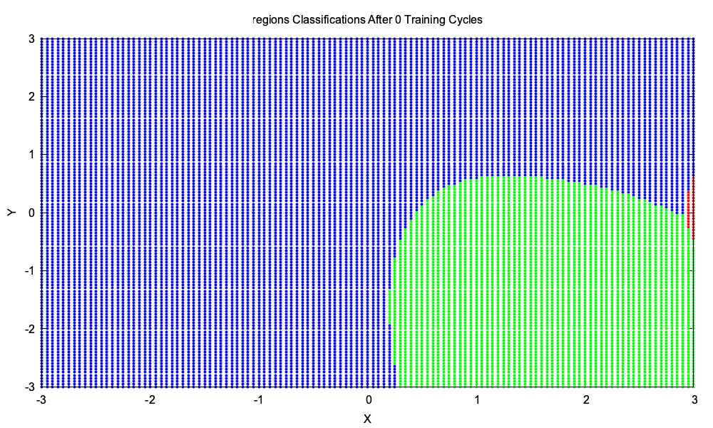
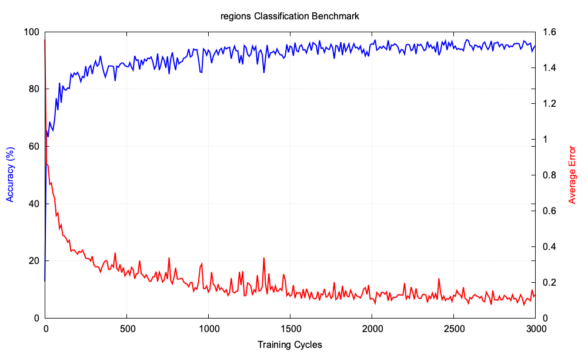
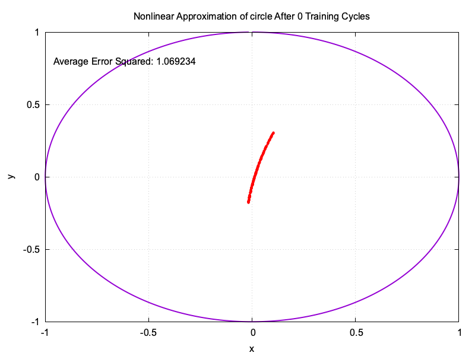
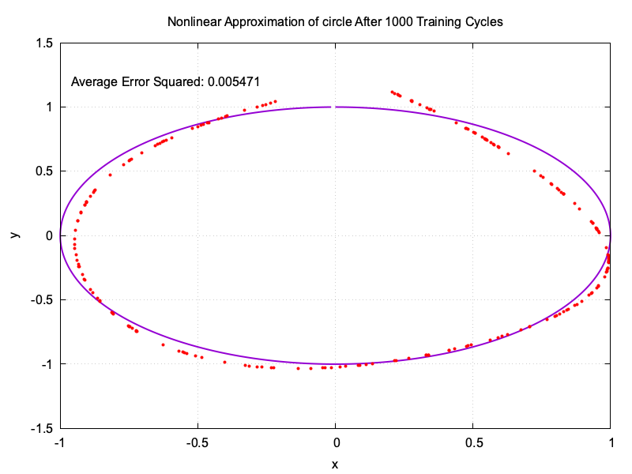
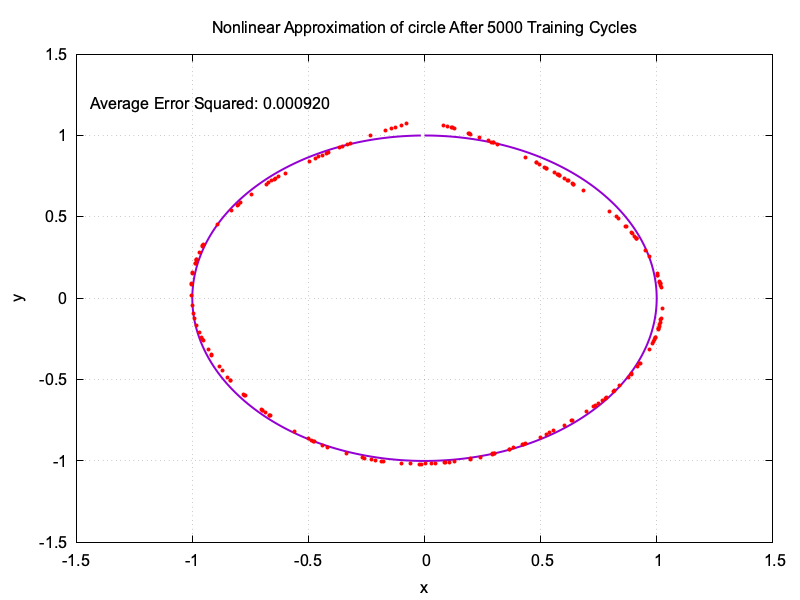
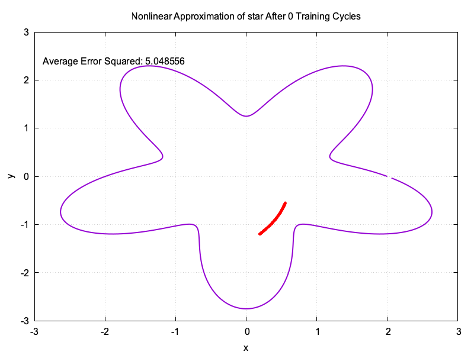
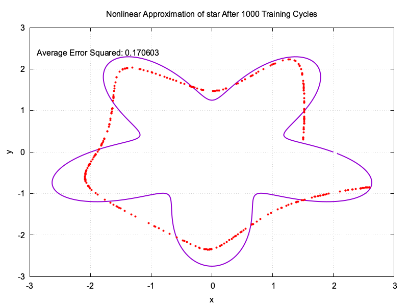
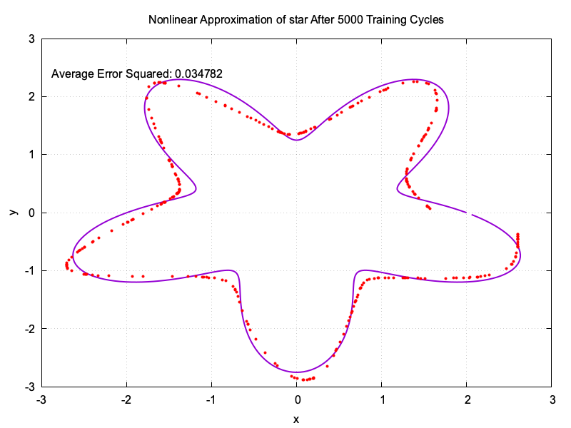

# Neural Network

A flexible all purpose multilayer perceptron neural network class.

The `NeuralNetwork` class handles generating network parameters, feedforward evaluation, loss metrics, single or batch training with gradient descent, and stores input loss gradients for easy chaining.

```cpp
/* Create Neural Network Instance */

NeuralNetwork myNeuralNetwork(
    3, // input node count
    {
        HiddenLayerParameters(10, RELU), // hidden layer with 10 nodes and relu activation
        HiddenLayerParameters(16, TANH), // hidden layer with 16 nodes and tanh activation
        
        HiddenLayerParameters(4, LINEAR) // output layer with 4 nodes and linear activation
    },
    SOFTMAX, // normalization function
    CATEGORICAL_CROSS_ENTROPY // loss function
);
```

```cpp
/* Initialize Parameters */

// optionally set distribution range for initial weights and bias
myNeuralNetwork.initializeRandomLayerParameters();
```

```cpp
/* Use DataPoint Class For Training */

std::vector<DataPoint> trainingDataPoints;

trainingDataPoints.emplace_back(
    Matrix({{ 0.2 }, { -0.4 }, { 0.3 }}), // input
    Matrix({{ 0.01 }, { 0.97 }, { 0.01 }, { 0.01 }}) // expected output
);

// ... add other training data ...
```

```cpp
/* Train Using A Single DataPoint */

float learningRate = 0.05;

myNeuralNetwork.train(trainingDataPoints[0], learningRate);
```

```cpp
/* Train Using A Batch */

float learningRate = 0.1;

myNeuralNetwork.batchTrain(trainingDataPoints, learningRate);
```

```cpp
/* Make A Prediction */

Matrix input({{ 0.3 }, { 0.7 }, { -0.2 }});

Matrix output = myNeuralNetwork.calculateFeedForwardOutput(input);
```

```cpp
/* Calculate The Loss For A Known Point */

Matrix expectedOutput({{ 0.97 }, { 0.01 }, { 0.01 }, { 0.01 }});

float loss = myNeuralNetwork.calculateLoss(input, expectedOutput);
```

## Examples

### 2D Region Based Classification






### Iris Species Classification


### Parametric Function Approximation

#### Circle





#### Star





### Polynomial Regression

#### Sin(x)

/after0.png)
/after1000.png)
/after5000.png)

#### Cos(x)

/after0.png)
/after1000.png)
/after5000.png)